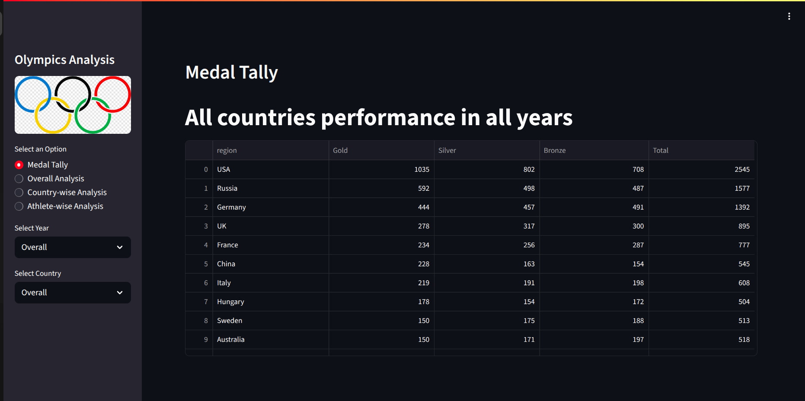
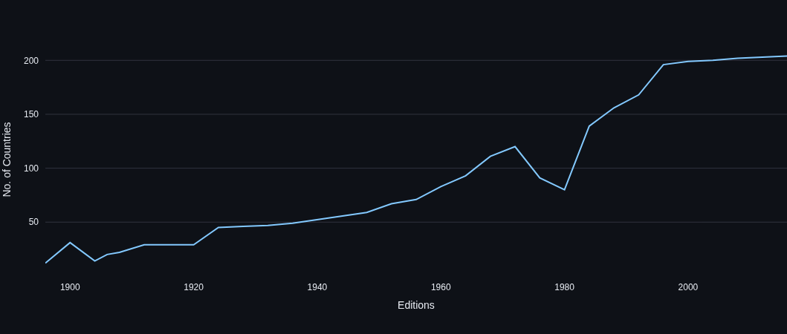
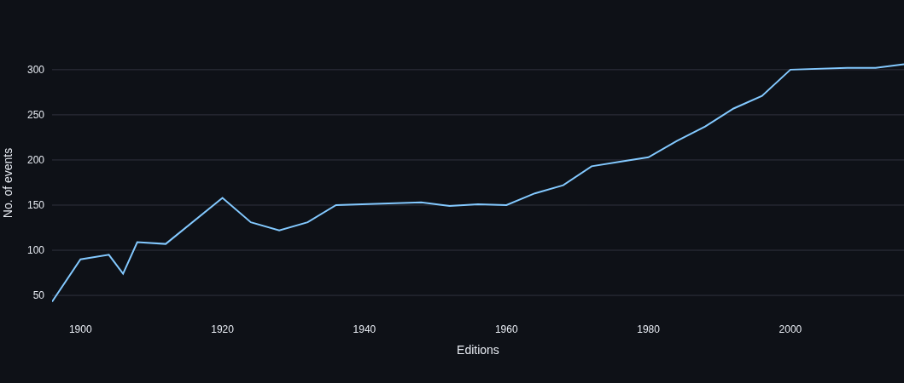
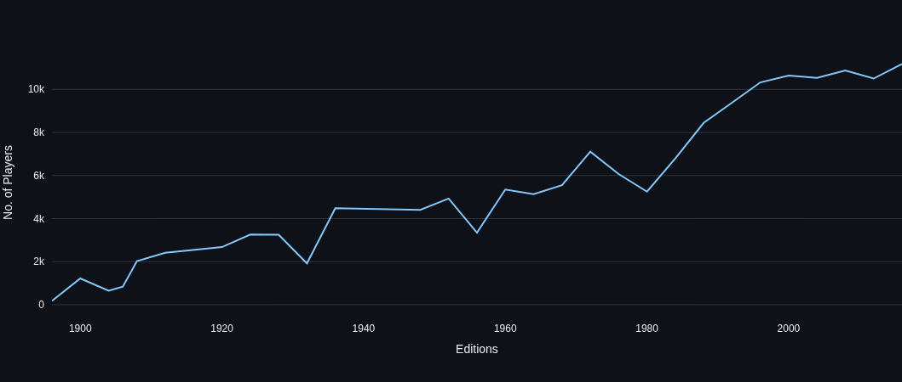
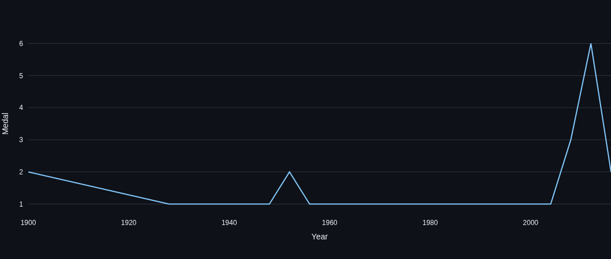
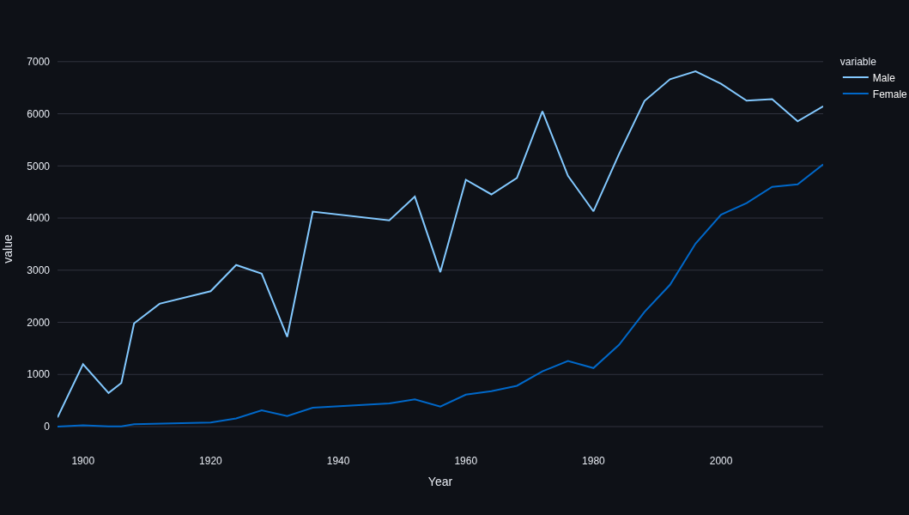
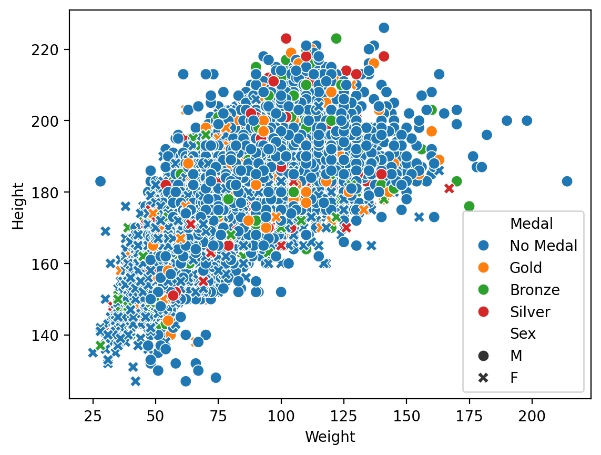

# 🏅 Olympics Analysis Dashboard

An interactive **Streamlit web app** to explore **120+ years of Olympic Games data**, visualizing medal tallies, athlete statistics, and country performance trends.


---

## 🎥 Demo Video

[](video/demo.webm)

_(Click to watch a short demo of the app in action!)_

---

## 📊 Features

### 🏆 Medal Tally

-   View medals by year, country, or overall.
-   Filter across Summer Olympics editions.
-   Compare countries over time.

### 🌍 Overall Analysis

-   Total editions, cities, sports, events, nations, and athletes.
-   Growth trends over time:
    -   Participating countries
    -   Number of events
    -   Athlete participation
-   Heatmap of **Events per Sport per Year**.
-   List of **Most Successful Athletes** globally or by sport.

### 🇮🇳 Country-wise Analysis

-   Country-specific **medal trend lines**.
-   Heatmap of **sports performance per year**.
-   Top 10 athletes from each country.

### 🧍 Athlete-wise Analysis

-   Age distributions for medalists (Gold/Silver/Bronze).
-   Age vs Sport insights for Gold medalists.
-   **Height vs Weight** visualization (by medal & gender).
-   **Men vs Women participation** over the years.

---

## 🖼️ Sample Visuals

| Type                                     | Preview                                                        |
| ---------------------------------------- | -------------------------------------------------------------- |
| **Participating Countries Over Time**    |          |
| **Events Over Time**                     |                |
| **Athletes Over Time**                   |            |
| **Country Medal Trend (India)**          |  |
| **Gender Distribution Over Time**        |                    |
| **Height vs Weight (by Medal & Gender)** |      |

> All screenshots generated directly from the Streamlit dashboard.

---

## ⚙️ Installation & Usage

### 1️⃣ Clone the Repository

```bash
git clone https://github.com/CodeFletcher/olympics-data-analysis.git
cd <repo-name>
```
